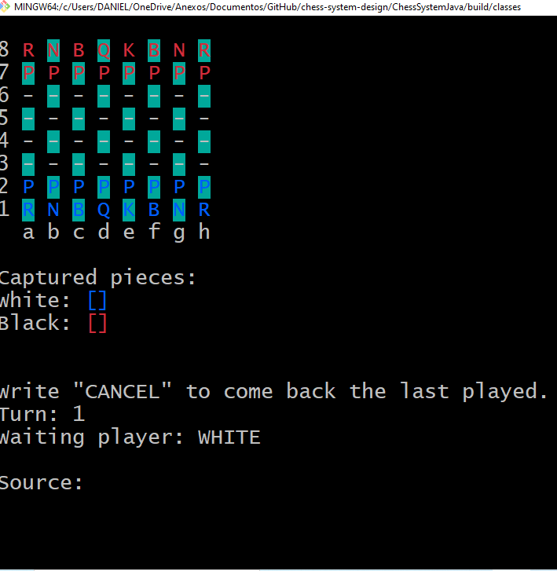

<h1>Chess System</h1>

<p align="center">
  <a href="#pre-requisites">Pré-requisitos</a> •
  <a href="#como-usar">Instalando o projeto</a> •
  <a href="#como-jogar">Como jogar</a> •
  <a href="#video">Video tutorial</a> •
</p>

 Tecnnologia utilizada **Java**

 

<h2 id="pre-requisites">💻 Requisitos</h2> 

Para rodar esse projeto você precisa ter o Java e git  instalado na sua máquina
<h2 id="como-usar"> 🚀 Instalando o projeto</h2>

Primeiro você deve clonar o repositório,

```bash
# Clone o repositório
$ git clone https://github.com/techdonne/chess-system-design.git

# Acesse-o
$ cd chess-system-design/ChessSystemJava/build/classes

#Para rodar
$ java application/Run
```
<h2 id="como-jogar"> 🚀 Como jogar</h2>

<p>Escolha o Source (origem) com a letra da coluna e o numero da linha, por exemplo: d2</p>
<p>Escolha o Target (destino) com a letra da coluna e o numero da linha, por exemplo: d4</p>
<p>Para cancelar a jogada apenas escreva "CANCEL" no Source (origem)</p>


<h2 id="video"> 🚀 Video Tutorial</h2>
👉 [Link do video do meu canal sobre o projeto](https://youtu.be/iG3tccs0Arw)
